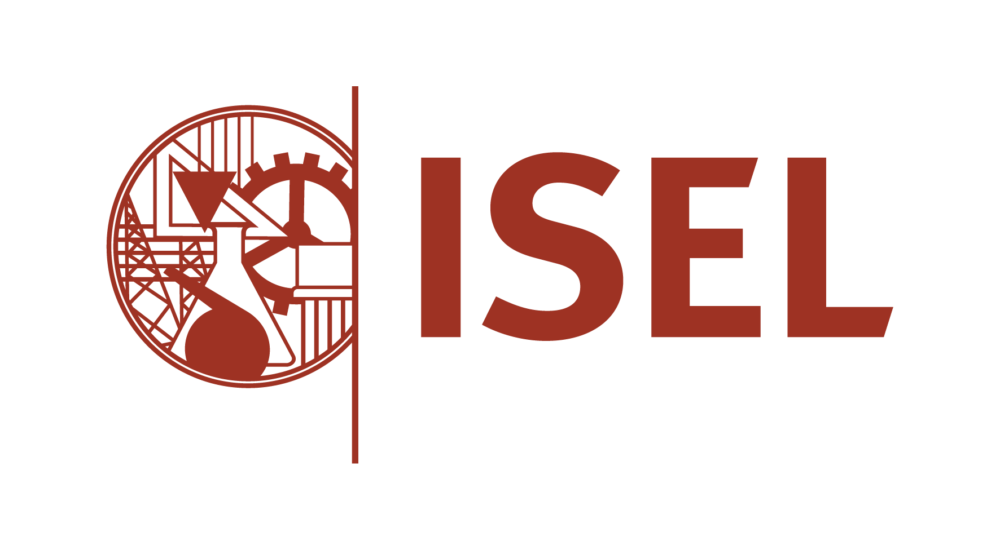

# Computer Security Repository

Welcome to the **Computer Security Repository**! This repository was created as part of the **Computer Security course** at 
the Engineering School of the Polytechnic University of Lisbon. 
It serves as a centralized resource for course examples preented during the lectures and used in assignments.

  

---

## Disclaimer

This repository is intended for **educational purposes only**.

---

## Contact

For any questions or feedback, feel free to reach out any member of the team. Alternatively, you can open an issue in this repository.

---

Happy learning and secure coding! 🚀
